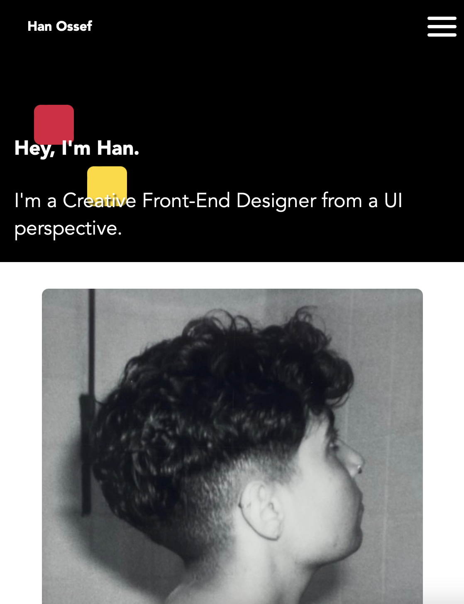
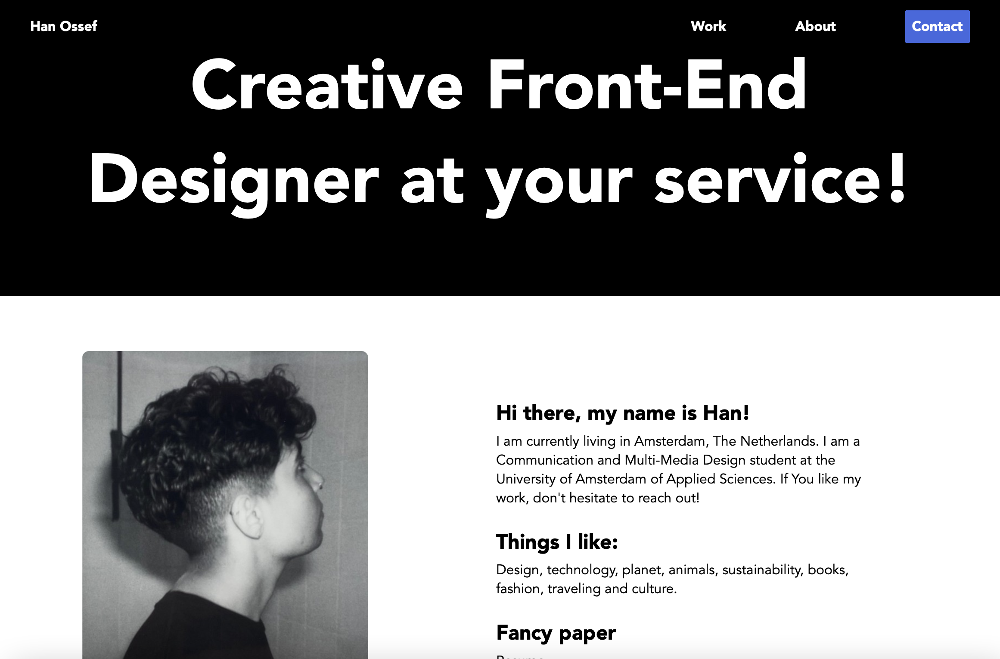
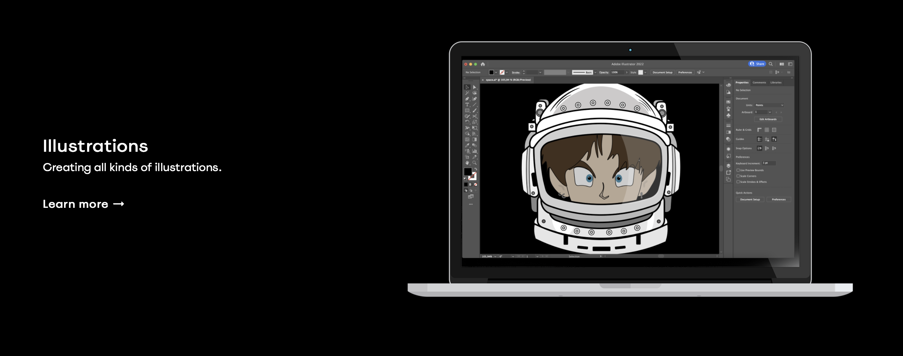
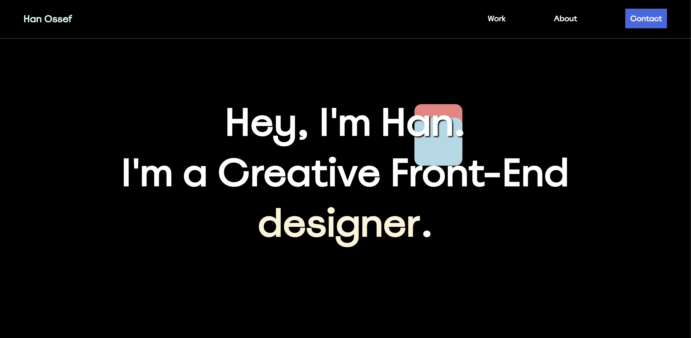
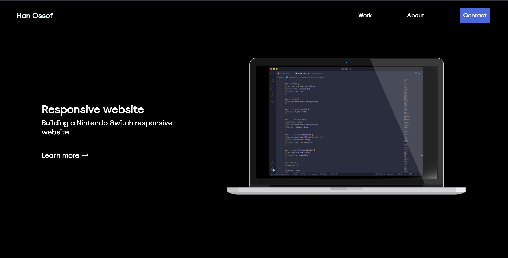
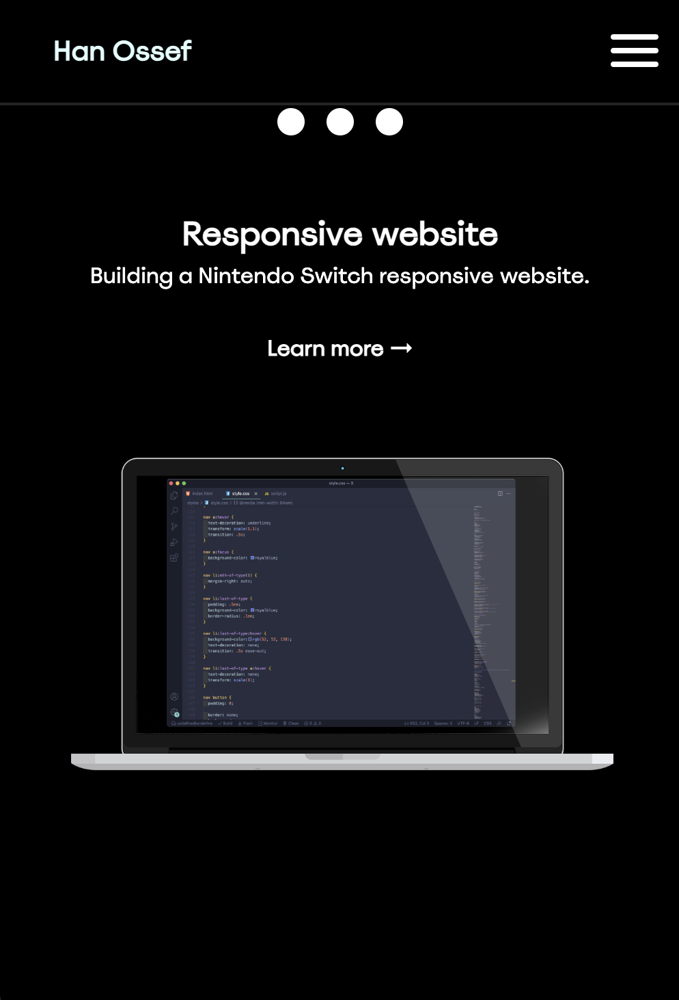
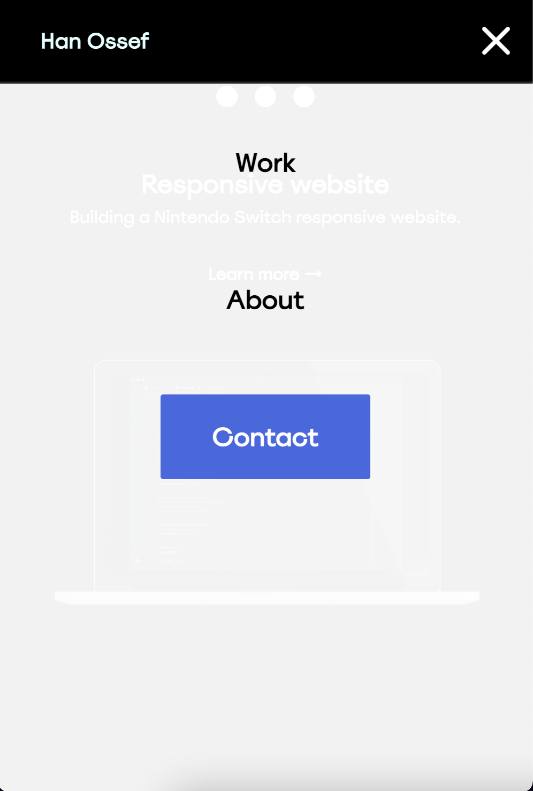
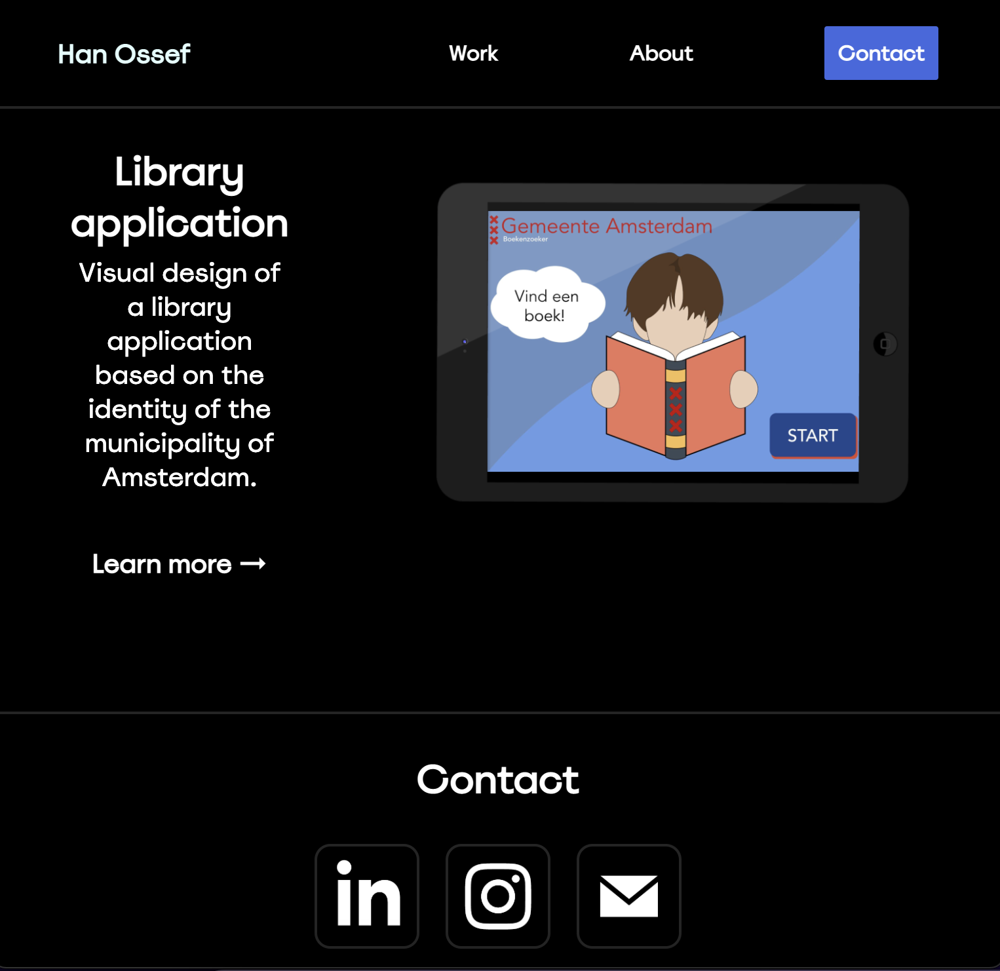

# Procesverslag 

## Jij

 Opdracht

### Auteur:
Han Ossef

#### SRP jaar 2:
Portfolio 

## Voortgang: dag 1

Wat heb ik gedaan in dag 1?

### Stand van zaken
In dag 1 heb ik inspiratie gezocht voor mijn portfolio website. Er zijn vele mooie manieren zoals de portfolio websites van Christina Vanessa en Sophie Brittain. De website van Yuki Asakura is de winnaar voor mij en die heb ik als inspiratie gebruikt voor mijn website.

## Voortgang: dag 2

Wat heb ik gedaan in dag 2?

### Stand van zaken

Tweede dag heb ik alle html elementen klaar gezet voor de index pagina. De andere pagina's ben ik nog niet aan begonnen omdat ik nog te erg twijfel over welke werken ik wil laten zien en hoe ik dat kan categoriseren. Ook ben ik begonnen aan de styling.

## Voortgang: dag 3

Wat heb ik gedaan in dag 3?

### Stand van zaken

Derde dag heb ik een dip gehad omdat ik even vast zit met mijn html. Ik weet gewoon echt niet welke design ik wil en telkens dingen verander of terug verander. Later op de dag heb ik mij even terug getrokken en even goed gekeken naar de website van Yuki Asakura. Ik heb geprobeerd om die index pagina op die manier neer te zetten.

## Voortgang: dag 4

Wat heb ik gedaan in dag 4?

### Stand van zaken

Deze dag heb ik mijn index pagina afgemaakt en werken gekozen die ik wil laten zien op mijn website waar ik erg tevreden over ben. Ik heb alle tekst uitgetypt en foto's bewerk in illustrator zodat ik het mooi kan laten zien in devices. Vervolgens heb ik alle andere pagina's in elkaar gezet en alle spellingen in het engels na laten checken

## Voortgang: dag 5

Wat heb ik gedaan in dag 5?

### Stand van zaken

 Laate kleine dingentjes aangepast voor een mooiere lay-out en nog beter responsive gemaakt

### Screenshot(s) van eind resultaat

Desktop

Mobiel

Tablet

## Bronnenlijst

Bronnenlijst gedurende proces

1. Voor inspiratie contact: https://www.sophiebritt.com/
2. Voor inspiratie index pagina layout: https://www.christinavanessa.com/
3. Voor Fade in en out van elementen: https://michalsnik.github.io/aos/ 
4. Voor inspiratie layout: https://www.yukiasakura.com 

